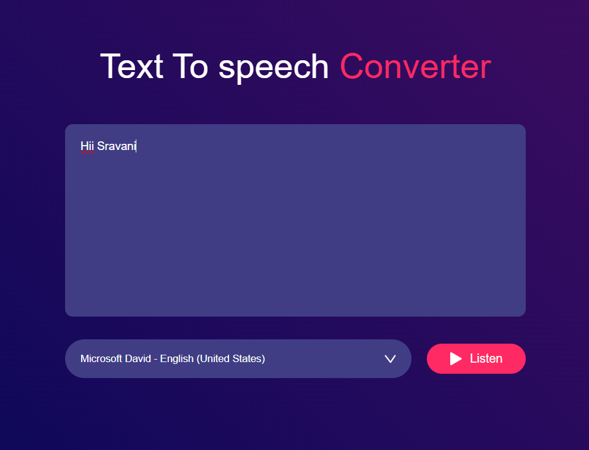

# 🎙️ Speech Generator Web App

🔗 **Live Demo:** https://sravani-speech-generator.netlify.app/

A simple and interactive text-to-speech web application built with HTML, CSS, and JavaScript that converts user-entered text into audible speech using the Web Speech API.

## 📌 Project Overview

This project allows users to enter text and listen to it as speech directly in the browser using the built-in Web Speech API. It demonstrates how modern browsers can convert text to spoken audio without any backend server or complex setup.

## 🛠️ Technologies Used

HTML – Structure of the app

CSS – Styling and layout

JavaScript – Speech synthesis logic using browser API

Web Speech API – Browser feature for text-to-speech

## 💡 Features

✔ User enters text in a text box
✔ Click a button to hear the text spoken aloud
✔ Uses built-in browser TTS (no external service required)
✔ Clean, responsive UI

## 🧩 How It Works

- User types or pastes text into the input area

- JavaScript captures the text

- Browser’s Text-to-Speech engine speaks the text aloud using speechSynthesis API

## 🧪 How to Run Locally

1. Clone the repository:

   git clone https://github.com/SravaniMuduru/Speech-Generator.git

2. Open the project folder:

   cd Speech-Generator

3. Open index.html in your browser

4. Double-click the file

5. OR right-click → Open with → Your browser

That’s it — no backend or installation required!

## 📸 Screenshots

### 🔹 App UI

### 🔹 Speaking Example

## 📈 Future Improvements

- Add voice rate and pitch controls

- Add language selection

- Add save audio as file feature

- Add responsive styles for mobile

- Add animations while speaking

## 🧠 Notes

This project uses the browser’s built-in text-to-speech feature — no API keys or backend needed

Works best in modern browsers like Chrome, Edge, and Firefox
